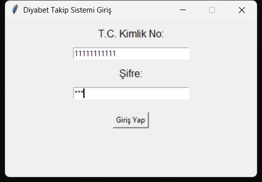
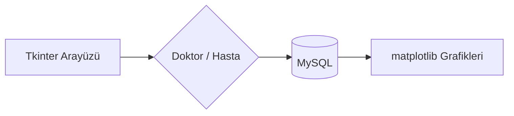

# Diyabet Takip Sistemi

Doktor ve hasta rollerine sahip, diyabet hastalarının kan şekeri ölçümlerini, diyet/egzersiz uyumunu ve doktor uyarılarını takip eden bir masaüstü uygulaması.



## Mimari



## Özellikler

- T.C. Kimlik No + şifre ile giriş, rol bazlı ekranlar (Doktor / Hasta)
- Kan şekeri ölçümü kayıtları ve grafiksel takibi (matplotlib)
- Diyet ve egzersiz planları, belirti (semptom) kaydı
- Kural tabanına göre otomatik uyarı üretimi (kan şekeri eşik değerlerine göre)
- İnsülin doz önerileri
- Hasta uyum skorları (diyet/egzersiz/ölçüm uyumu) ve son 30 günlük uyum grafiği
- Doktordan hastaya bildirimler

## Teknoloji

- Python, Tkinter (arayüz)
- MySQL
- matplotlib, tkcalendar

## Kurulum

> Bu bir Tkinter masaüstü uygulamasıdır; grafik arayüzü nedeniyle Docker ile çalıştırmak pratik değildir, aşağıdaki adımlarla doğrudan çalıştırın.

```bash
pip install -r requirements.txt
```

Veritabanını oluşturun:

```bash
mysql -u root -p < diyabet_takip_sistemi_schema.sql
```

Ortam değişkenlerini ayarlayın:

```bash
set DB_HOST=localhost
set DB_USER=root
set DB_PASSWORD=your_mysql_password
set DB_NAME=diyabet_takip_sistemi
```

Ardından çalıştırın:

```bash
python diyabet_takip_sistemi.py
```

## Demo hesaplar

Şema dosyası örnek (sahte) veriyle iki demo kullanıcı oluşturur:

- Doktor — T.C. No: `11111111111`, şifre: `doktor123`
- Hasta — T.C. No: `22222222222`, şifre: `hasta123`
